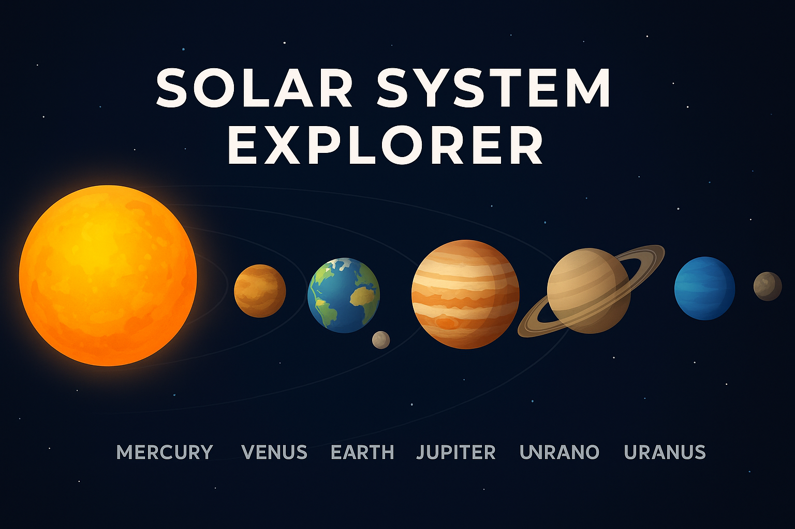

# 🌌 Solar System Explorer



[](https://github.com/Devansh-Bansal-AI/Solar-system/stargazers)
[](https://github.com/Devansh-Bansal-AI/Solar-system/network)
[](./LICENSE)


An interactive, 3D-inspired web application that lets you explore the planets of our solar system with rich visuals, detailed information, and engaging animations — all built with **HTML** and **CSS**.

---

## 🚀 Features

- **Interactive Planet Selection** – Click any planet to bring it into focus
- **Moons & Orbits** – Dashed orbital paths and labeled moons
- **3D Illusion** – CSS transforms + animations create depth
- **Responsive** – Works across modern browsers and screen sizes

---


## 🛠️ Tech Stack

- **HTML5** for structure
- **CSS3** for layout, animations, and 3D transforms
- **Google Fonts (Montserrat)**

---

## 📂 Project Structure

```
├── index.html     # Main page
├── style.css      # Styles, animations, layout
├── banner.png     # README banner image
└── README.md      # Project documentation
```

---

## ⚙️ How to Run Locally

1. Clone the repository:
   ```bash
   git clone https://github.com/Devansh-Bansal-AI/Solar-system.git
   cd Solar-system
   ```
2. Open `index.html` directly in your browser **or** serve locally:
   ```bash
   python -m http.server
   # then open http://localhost:8000
   ```

---

## 🌍 Supported Planets (as styled in CSS)

Mercury · Venus · Earth (Moon) · Mars (Deimos, Phobos) · Jupiter (Io, Europa, Ganymede) · Saturn (Titan, Dione, Enceladus) · Uranus (Miranda, Ariel, Umbriel) · Neptune (Triton, Proteus, Nereid) · Pluto

---

## 📜 License

This project is licensed under the **MIT License**. See `LICENSE` for details.

---

If you find this useful, please ⭐ the repository!
